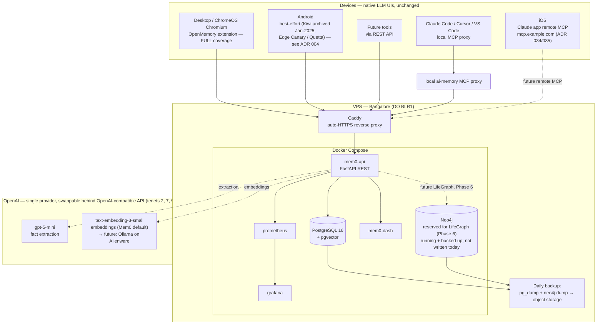

# Architecture

Self-hosted, cross-platform AI memory infrastructure. A persistent memory layer
plus knowledge graph that sits underneath native LLM interfaces — no custom chat
UI, no per-conversation API cost. See `docs/decisions/` for the reasoning behind
each choice and `docs/tenets.md` for the principles that constrain them.

## System overview

> **Why one provider?** Both stages run on OpenAI — `gpt-5-mini` (extraction,
> Mem0's current default) and `text-embedding-3-small` (embeddings, Mem0's
> default). A 2026 re-price collapsed the old ₹30-vs-₹400 cost gap (that was
> against `gpt-4o-mini`), so by tenets 7 & 9 one provider wins: one key, one
> bill, no per-component config. Extraction on `gpt-5-mini` is ~₹90/mo (~2–3×
> the `gpt-4.1-nano` tier) — still trivial at ~50 interactions/day — and is
> chosen for **structured-output reliability** (valid JSON + nuanced venture
> categorization), not cost. DeepSeek/Qwen and `gpt-4.1-nano` stay documented,
> swappable alternatives; steady state moves both stages to local Ollama on the
> Alienware. See ADR 011 (embeddings) and ADR 013 (single-provider, supersedes ADR 002).

> **Neo4j status (ADR 032) — provisioned, not yet in use.** Neo4j is deployed,
> healthy, and backed up, but **nothing writes to it today.** The deployed Mem0
> server never reads `NEO4J_*` and configures no graph store, and mem0ai 2.0.4
> ships no graph-memory code (so the `mem0ai[graph]` extra and the compose
> `NEO4J_*` env vars are currently inert). Neo4j is **reserved for LifeGraph**
> (people / ventures / skills / decisions / milestones), which is **Phase 6 and
> not yet built**. Earlier docs called this a "dual namespace (Mem0 auto-managed
> graph + LifeGraph)"; that overstated reality and was corrected 2026-06-10. Until
> Phase 6, decision-supersession history lives in Mem0's SQLite history table + the
> Daily Driver supersession convention, not in Neo4j.

## Components & cost

Every recurring component, with its monthly cost inline (tenet 6 — cost stays
visible). Rupee figures are approximate steady-state estimates at ~50
interactions/day; see ADR 002 for the extraction-cost model.

| Component | Role | Monthly cost |
|---|---|---|
| Domain name | The project's address; one registered name, subdomains carved out of it | **(~₹85/mo)** (~₹1,000/yr) |
| VPS — DigitalOcean 4GB droplet, BLR1 (Bangalore) | Runs the whole Docker Compose stack (Mem0 API, Postgres/pgvector, Neo4j, dashboard, Caddy, monitoring); single-node by design (ADR 019) | **(~₹2,000/mo)** |
| OpenAI `gpt-5-mini` — extraction LLM | Pulls discrete facts out of conversations; chosen for structured-output reliability (ADR 013, supersedes DeepSeek/ADR 002) | **(~₹90/mo)** |
| OpenAI `text-embedding-3-small` — embeddings | Vectorizes facts + queries for pgvector similarity search (Mem0's default embedder) | **(~₹15/mo)** |
| DO Spaces — backup object storage | Off-box destination for daily `pg_dump` + Neo4j dumps (Phase 2) | **(~₹400/mo)** |
| GitHub — repo + Actions (CI/CD) | Source of truth, CI on PRs, CD to the VPS, weekly backup/eval jobs | **(₹0)** (free for public repo) |
| | **Approx. total** | **~₹2,590/mo** |

> **List price vs. landed cost (TCO).** The figures above are **vendor list price**
> (locale-neutral). The *total cost of ownership* for an India-based operator is
> **~30% higher** — **18% GST** on imported digital services plus **~4–6% forex**
> (card markup + FX spread) — so plan against **list × ~1.3** (here, ~₹3,370/mo
> infra landed). We estimate and budget on landed cost, not the sticker (tenet 6).

**Domain sub-components** — the single domain name decomposes into several
pieces; all are ₹0 beyond the registration fee above (Cloudflare DNS is free).
DNS lives at Cloudflare (ADR 016, supersedes ADR 012); compute is a single
DigitalOcean droplet in BLR1 (ADR 019 — cost/latency/exit rationale vs
AWS/GCP/Azure/Hetzner).

| Sub-component | Role | Cost |
|---|---|---|
| Cloudflare Registrar | Where `example.com` is bought and renewed at-cost | (in domain fee) |
| DNS zone @ Cloudflare | Authoritative DNS; zone created at registration, A records managed by Terraform | **(₹0)** |
| DNS records | Terraform-created A records: `memory.`, `dash.`, `graph.`, `monitor.` (+ apex) → the droplet IP; `proxied=false` for ACME | **(₹0)** |
| Caddy + Let's Encrypt TLS | Auto-provisions and renews HTTPS certificates for every subdomain; only component facing the internet | **(₹0)** |

Steady state (Dec 2026+, post-Alienware): embeddings and extraction move to
local Ollama on the Alienware (→ ₹0 model cost), and the VPS can downsize as
Neo4j moves local — projected ~₹1,000/mo. See `docs/planning/setup-prompt.md`.

## Subdomains (behind Caddy, HTTPS)

| Subdomain | Service | Notes |
|---|---|---|
| `memory.{domain}` | Mem0 REST API | JWT + API key auth; CORS via `DASHBOARD_URL` env (extension allowlist — full hardening in BACKLOG) |
| `dash.{domain}`   | Mem0 dashboard | basic auth |
| `graph.{domain}`  | Neo4j Browser | basic auth |
| `monitor.{domain}`| Grafana | basic auth |

Only Caddy faces the internet; Postgres, Neo4j, and Prometheus stay on the
Docker internal network (ADR 009).

## Coverage matrix

| Surface | Memory path | Status |
|---|---|---|
| Desktop / ChromeOS | OpenMemory Chrome extension | Full |
| Android | Edge Canary / Quetta + extension | Best-effort (ADR 004) |
| iOS — Claude | Remote MCP connector (`mcp.{domain}`, Streamable HTTP, self-hosted OAuth 2.1) | **Live** — connector registered + OAuth-approved on claude.ai 2026-06-10 (ADR 034/035); iPhone inherits from web; operator-verified connector call 2026-06-10 |
| Perplexity (web + iOS) | Custom remote connector to the same MCP endpoint (OAuth 2.0/DCR, ADR 036) | **Live** — registered + OAuth-approved 2026-06-10; web `search_memories` round-trip verified; **iPhone inherits connector from web** (operator-verified 2026-06-10) |
| ChatGPT (web + iOS) | Developer-mode custom app to the same MCP endpoint (OAuth/DCR, ADR 036) | **Live** — registered + OAuth-approved 2026-06-10; web `search_memories` verified in proxy logs; **iPhone inherits connector from web** (operator-verified 2026-06-10). ChatGPT may show abbreviated tool snippets in-thread, not full JSON |
| iOS — Gemini/DeepSeek | No remote MCP path | Gap (unchanged) |
| Claude Code / Cursor / VS Code | Local stdio MCP proxy to live REST API | Full |
| Any future tool | REST API | Full |

## Agent personas

The first consumers of the shared memory layer are defined in
`docs/agent-personas.md`: Build Agent, Research and Strategy Agent, and Operator
Assistant, with a supporting Memory Steward role for hygiene and metadata. Skills
must attach to one of these owners before they are built.

## Degradation

VPS down ⇒ every LLM still works with its own native memory; the extension
fails silently, the MCP connector degrades gracefully. No data loss (Postgres
persists to disk + daily backups). Enrichment resumes on recovery (tenet 4).
