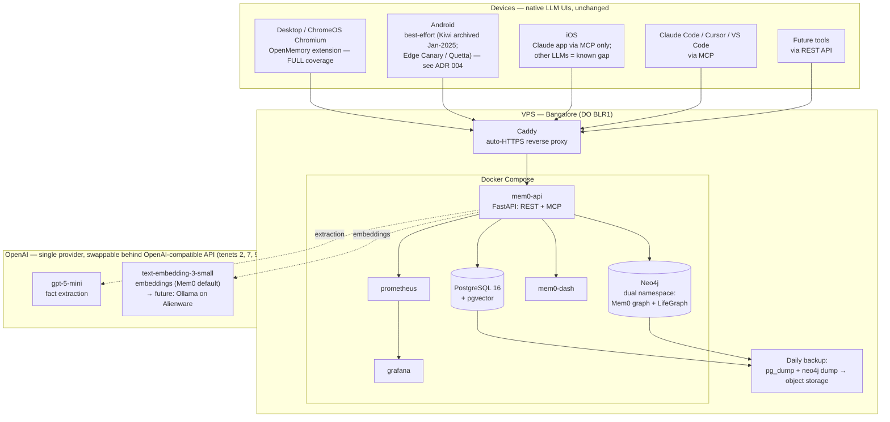

# Architecture

Self-hosted, cross-platform AI memory infrastructure. A persistent memory layer
plus knowledge graph that sits underneath native LLM interfaces — no custom chat
UI, no per-conversation API cost. See `docs/decisions/` for the reasoning behind
each choice and `docs/tenets.md` for the principles that constrain them.

## System overview

> **Why one provider?** Both stages run on OpenAI — `gpt-5-mini` (extraction,
> Mem0's current default) and `text-embedding-3-small` (embeddings, Mem0's
> default). A 2026 re-price collapsed the old ₹30-vs-₹400 cost gap (that was
> against `gpt-4o-mini`), so by tenets 7 & 9 one provider wins: one key, one
> bill, no per-component config. Extraction on `gpt-5-mini` is ~₹90/mo (~2–3×
> the `gpt-4.1-nano` tier) — still trivial at ~50 interactions/day — and is
> chosen for **structured-output reliability** (valid JSON + nuanced venture
> categorization), not cost. DeepSeek/Qwen and `gpt-4.1-nano` stay documented,
> swappable alternatives; steady state moves both stages to local Ollama on the
> Alienware. See ADR 011 (embeddings) and ADR 013 (single-provider, supersedes ADR 002).

## Components & cost

Every recurring component, with its monthly cost inline (tenet 6 — cost stays
visible). Rupee figures are approximate steady-state estimates at ~50
interactions/day; see ADR 002 for the extraction-cost model.

| Component | Role | Monthly cost |
|---|---|---|
| Domain name | The project's address; one registered name, subdomains carved out of it | **(~₹85/mo)** (~₹1,000/yr) |
| VPS — DigitalOcean 4GB droplet, BLR1 (Bangalore) | Runs the whole Docker Compose stack (Mem0 API, Postgres/pgvector, Neo4j, dashboard, Caddy, monitoring) | **(~₹2,000/mo)** |
| OpenAI `gpt-5-mini` — extraction LLM | Pulls discrete facts out of conversations; chosen for structured-output reliability (ADR 013, supersedes DeepSeek/ADR 002) | **(~₹90/mo)** |
| OpenAI `text-embedding-3-small` — embeddings | Vectorizes facts + queries for pgvector similarity search (Mem0's default embedder) | **(~₹15/mo)** |
| DO Spaces — backup object storage | Off-box destination for daily `pg_dump` + Neo4j dumps (Phase 2) | **(~₹400/mo)** |
| GitHub — repo + Actions (CI/CD) | Source of truth, CI on PRs, CD to the VPS, weekly backup/eval jobs | **(₹0)** (free for public repo) |
| | **Approx. total** | **~₹2,590/mo** |

**Domain sub-components** — the single domain name decomposes into several
pieces; all are ₹0 beyond the registration fee above (DigitalOcean DNS is free).
DNS lives entirely at DigitalOcean so Terraform manages every record with one
provider and one token (ADR 012, tenets 1 & 7).

| Sub-component | Role | Cost |
|---|---|---|
| Registrar | Where the name is bought and renewed; its only job is to hold the registration and delegate DNS to DigitalOcean | (in domain fee) |
| DNS zone @ DigitalOcean | Authoritative DNS for the domain; the zone is created and owned by Terraform | **(₹0)** |
| Nameserver delegation | Registrar's NS records point to `ns1/ns2/ns3.digitalocean.com` so DO answers all queries (one-time manual step at the registrar) | **(₹0)** |
| DNS records | Terraform-created A records: `memory.`, `dash.`, `graph.`, `monitor.` (+ apex) → the droplet IP | **(₹0)** |
| Caddy + Let's Encrypt TLS | Auto-provisions and renews HTTPS certificates for every subdomain; only component facing the internet | **(₹0)** |

Steady state (Dec 2026+, post-Alienware): embeddings and extraction move to
local Ollama on the Alienware (→ ₹0 model cost), and the VPS can downsize as
Neo4j moves local — projected ~₹1,000/mo. See `docs/planning/setup-prompt.md`.

## Subdomains (behind Caddy, HTTPS)

| Subdomain | Service | Notes |
|---|---|---|
| `memory.{domain}` | Mem0 API (REST + MCP) | JWT auth; CORS allowlist |
| `dash.{domain}`   | Mem0 dashboard | basic auth |
| `graph.{domain}`  | Neo4j Browser | basic auth |
| `monitor.{domain}`| Grafana | basic auth |

Only Caddy faces the internet; Postgres, Neo4j, and Prometheus stay on the
Docker internal network (ADR 009).

## Coverage matrix

| Surface | Memory path | Status |
|---|---|---|
| Desktop / ChromeOS | OpenMemory Chrome extension | Full |
| Android | Edge Canary / Quetta + extension | Best-effort (ADR 004) |
| iOS — Claude | Remote MCP connector | Full |
| iOS — ChatGPT/Gemini/DeepSeek | none | Known gap |
| Claude Code / Cursor / VS Code | MCP client | Full |
| Any future tool | REST API | Full |

## Degradation

VPS down ⇒ every LLM still works with its own native memory; the extension
fails silently, the MCP connector degrades gracefully. No data loss (Postgres
persists to disk + daily backups). Enrichment resumes on recovery (tenet 4).
