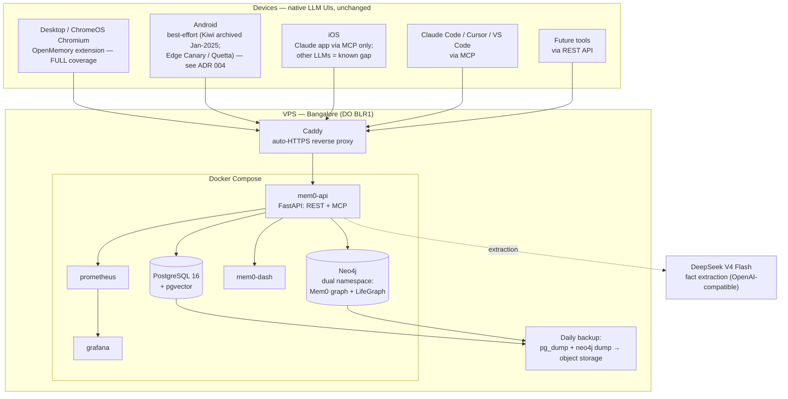

# Architecture

Self-hosted, cross-platform AI memory infrastructure. A persistent memory layer
plus knowledge graph that sits underneath native LLM interfaces — no custom chat
UI, no per-conversation API cost. See `docs/decisions/` for the reasoning behind
each choice and `docs/tenets.md` for the principles that constrain them.

## System overview

## Subdomains (behind Caddy, HTTPS)

| Subdomain | Service | Notes |
|---|---|---|
| `memory.{domain}` | Mem0 API (REST + MCP) | JWT auth; CORS allowlist |
| `dash.{domain}`   | Mem0 dashboard | basic auth |
| `graph.{domain}`  | Neo4j Browser | basic auth |
| `monitor.{domain}`| Grafana | basic auth |

Only Caddy faces the internet; Postgres, Neo4j, and Prometheus stay on the
Docker internal network (ADR 009).

## Coverage matrix

| Surface | Memory path | Status |
|---|---|---|
| Desktop / ChromeOS | OpenMemory Chrome extension | Full |
| Android | Edge Canary / Quetta + extension | Best-effort (ADR 004) |
| iOS — Claude | Remote MCP connector | Full |
| iOS — ChatGPT/Gemini/DeepSeek | none | Known gap |
| Claude Code / Cursor / VS Code | MCP client | Full |
| Any future tool | REST API | Full |

## Degradation

VPS down ⇒ every LLM still works with its own native memory; the extension
fails silently, the MCP connector degrades gracefully. No data loss (Postgres
persists to disk + daily backups). Enrichment resumes on recovery (tenet 4).
