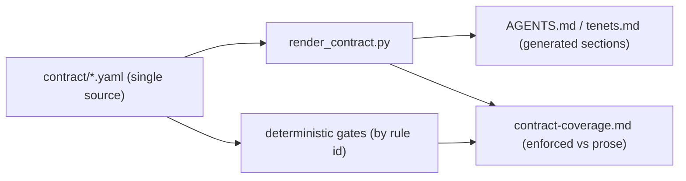

# ADR 033: Operating contract as a structured single-source (model-agnostic)

**Status:** Implemented (2026-06-10) — migration steps 1–4 done; the structured
single-source + renderer + gates are live. Step 5 (this status update) complete.
Direction was Accepted (Option B) the prior session.
**Date:** 2026-06-10
**Deciders:** the operator (chose Option B), agent (design)
**Ties:** tenet 2 (editor/model-agnostic), tenet 10 (no drift), tenet 14 (errors are
mechanisms — fix the control plane), ADR 018 (pointer files carry no content), ADR
027/030 (deterministic gates + portable hooks), `docs/interfaces.md` §8.

### Context — the problem (why now)

Adherence to the operating contract **varies by model.** Switching between a strong
model (e.g. Opus 4.8, high reasoning) and a cheaper/faster one (e.g. Composer 2.5)
changes how well tenets, teaching/concierge style, scope discipline, and the
Definition of Done are honored. Root cause: the contract is delivered as **~900
lines of prose** in `AGENTS.md` + `docs/tenets.md` that the model must *read and
choose to follow*. Prose is a weak, model-dependent interface.

What is **already** model-independent (deterministic gates, do not care which model
is active): commit/push handoff (`completion_gate.py`), STATUS shape
(`check_status_snapshot.py`), repo integrity (`check-repo-health`), secret scanning
(gitleaks pre-commit), memory-write conformance (`check_memory_contract.py`), CI.
These were each built *after* a failure (COE-driven). The pattern works.

The principle (structured input over freeform text for agents): **the parts of the
contract that matter must be structured data + mechanisms, not prose hope.** Prose
remains the human-readable narrative, but it should be *generated from* the
structured source, and the high-value rules should each have an enforcement status.

### Decision

Make the operating contract a **structured single-source** that both (a) renders the
human-readable `AGENTS.md`/tenets prose and (b) is the registry the deterministic
gates check against. Prose stops being hand-authored canonical content; it becomes a
generated view.

This is **Option B** (operator's choice). Bigger lift than adding one more gate, so
it is sequenced as its own session.

### Design

#### 1. Structured source (`contract/` in `ai-memory-infra`)

Machine-readable YAML, one record per rule. Proposed files:

- `contract/tenets.yaml` — the 18 tenets.
- `contract/practices.yaml` — engineering practices (with the `[in place]`/`[target]`
  status now in `AGENTS.md`).
- `contract/dod.yaml` — Definition-of-Done trigger table (change-type -> docs to update).
- `contract/style.yaml` — teaching/concierge/operator-interaction rules.

Record schema (each rule):

```yaml
- id: tenet-16                      # stable id, referenced by gates + COEs
  title: "Stateless, disposable sessions"
  statement: "One task per session; state lives in files, not chat..."
  rationale: "context-window amplification; COE 2026-06-08"
  severity: critical | high | normal
  applies_to: [build, ops, concierge, all]
  enforcement:
    status: enforced | tested | prose       # be honest, like docs/interfaces.md
    mechanism: "scripts/check_status_snapshot.py + completion_gate.py"
    gate_id: status-shape                    # null when prose-only
  source_refs: ["docs/coe/2026-06-08-cursor-credit-exhaustion.md"]
```

#### 2. Renderer (`scripts/render_contract.py`)

- Generates the tenets summary, practices, and DoD-trigger sections of `AGENTS.md`
  (between marked `<!-- generated:tenets start -->` / `end` fences) and the full
  `docs/tenets.md` from the YAML. Hand-edited prose outside the fences is preserved.
- Emits an **enforcement-coverage report** (`docs/reports/contract-coverage.md`):
  every rule with its `enforcement.status`, so the prose-only (model-dependent)
  rules are visible and trackable — the same honesty move as `docs/interfaces.md`.
- A `--check` mode (CI + pre-commit gate) fails if the generated sections in
  `AGENTS.md`/`tenets.md` are stale vs the YAML (drift becomes impossible by
  construction — closes the ADR 018 / pointer-drift class).

#### 3. Gates read the same ids

Existing and new gates reference `contract/*.yaml` rule ids (e.g. a gate annotates
which `gate_id` it implements), so the coverage report is generated from reality, not
maintained by hand.



#### 4. Enforcement backlog (convert top prose-only rules to gates)

Prioritized from the model-dependence audit (these are the rules most likely to
drift on a weaker model). Build as separate, COE-pattern mechanisms after the
source+renderer land:

1. **Final-response / handoff validator** — extend `completion_gate.py` (or a new
   turn-end check) to verify the final answer satisfies the handoff DoD: every
   touched repo committed+pushed *or* a named blocker; STATUS checkpointed before a
   resume prompt is emitted; no false resume token mid-step. (Promoted P1 governance
   item in BACKLOG.)
2. **Operator-action format gate** — `scripts/operator_action.py` already validates
   concierge action format; wire it so operator-facing action prompts are actually
   routed through it (today it is opt-in).
3. **Pointer-file purity gate** — fail if `.cursor/rules/*` or `CLAUDE.md` carry
   tenet/rule content beyond a pointer (ADR 018 enforcement; closes COE
   2026-06-07-cursor-rule-drift).
4. **DoD trigger-table conformance** — for a changed area, check the trigger row's
   target docs were touched in the same change (best-effort, severity-tiered).

### Migration steps (for the implementing session)

1. Extract the current 18 tenets + DoD table + practices into `contract/*.yaml`
   verbatim (no wording changes — pure lift); add `enforcement.status` per rule from
   the audit + `docs/interfaces.md`.
2. Write `render_contract.py` (+ tests, TDD); add fenced generated regions to
   `AGENTS.md`/`tenets.md`; verify the rendered output is byte-equal to the current
   prose (a no-op diff proves the lift is faithful).
3. Wire `render_contract.py --check` into pre-commit + CI.
4. Publish `contract-coverage.md`; pick the top 1-2 enforcement-backlog gates for the
   following session(s).
5. Update this ADR Status to `Implemented` and add a Propagation note.

### Consequences

- **Positive:** one source of truth for the contract; prose can't drift from the
  enforced rules; the model-dependent surface is *measured* (coverage report) and
  shrinks deliberately over time; weaker models get the same hard guarantees.
- **Negative:** a build cost + a new generator to maintain; risk of over-structuring
  narrative that is genuinely better as prose (mitigation: only fence the
  enumerable sections — tenets, DoD, practices — leave teaching narrative as prose
  with ids referenced, not fully templated).
- **Reversibility:** two-way door — it generates the same docs we already keep; if it
  proves heavy, delete the generator and keep the YAML as a checklist.

### Propagation / conformance (implementation, 2026-06-10)

- **Structured source:** `contract/tenets.yaml` (18), `contract/practices.yaml` (8),
  `contract/dod.yaml` (12 trigger rows) — each rule carries the prose **verbatim**
  plus `enforcement.status` + `mechanism` + `gate_id`.
- **Renderer:** `scripts/render_contract.py` regenerates the fenced sections of
  `AGENTS.md` (`agents-tenets` / `agents-practices` / `agents-dod`) and
  `docs/tenets.md` (`tenets-full`), and writes `docs/reports/contract-coverage.md`.
  `--check` is the gate. TDD: `tests/test_scripts/test_render_contract.py`.
- **Faithful lift proven:** the rendered fenced regions are **byte-equal** to the
  prior hand-authored prose — the only diff to `AGENTS.md`/`tenets.md` was the
  inserted `<!-- generated:* -->` fence comments (no prose changed); the in-sync
  integration test pins this going forward.
- **Wired:** `render_contract.py --check` in `scripts/hooks/pre-commit` (gate 4) +
  `.github/workflows/ci.yml`. PyYAML added to `pyproject.toml` deps.
- **Registry:** `docs/interfaces.md` §9 (operating contract) + §10 (pointer purity).
- **First enforcement-backlog gate landed:** #3 pointer-file purity
  (`scripts/check_pointer_purity.py`, ADR 018; pre-commit gate 5 + CI) — promotes
  DoD row `dod-05` from prose → **enforced** in the coverage report. Coverage now:
  38 rules, 11 enforced / 0 tested / 27 prose (the model-dependent surface is now
  *measured* and shrinking, exactly the ADR's intent). Remaining backlog gates
  (#1 final-response/handoff validator, #2 operator-action routing, #4 DoD
  trigger-table conformance) stay parked in `BACKLOG.md`.

### Out of scope (explicitly)

Rewriting teaching/concierge *narrative* into rigid templates; per-rule gates beyond
the backlog list; any change that weakens an existing gate. The narrowly
**glob-scoped** Cursor helper rules (`10-python-tdd.mdc`, `20-docs-dod.mdc`) are not
touched by the pointer-purity gate (scoped to `alwaysApply` rules + `CLAUDE.md`);
whether those may carry conventions at all is a separate parked decision.
