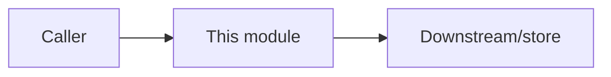

# Design Doc — <phase / module / capability name>

> **Fill this in BEFORE writing code** for any new phase, `src/` module, or
> user-facing capability (DoD trigger in `AGENTS.md`). It is the HLD + LLD that an
> ADR (a *decision*) does not capture: the *shape* of the thing being built. Keep
> it proportional to stakes (tenet 8) — a small module gets a short doc; a phase
> gets the full set. Copy this file to `docs/design/<name>.md`.
>
> **Why a design step (model-agnostic intent):** a written HLD/LLD is structured
> input that any model can implement consistently, instead of re-deriving the
> design from prose every session and drifting. Tests-first (TDD) implements
> against the contracts named here.

## 0. Metadata

- **Scope:** phase / module / capability
- **Status:** `draft` | `in-review` | `approved` | `built`
- **Author / date:**
- **Related ADRs:** (decisions this design implements or assumes)
- **Related interfaces:** (rows in `docs/interfaces.md` this touches or adds)

## 1. Problem & scope

- **What problem does this solve?** (1-3 sentences, tied to the STATUS goal / phase.)
- **In scope:** (bullet list — what this delivers)
- **Out of scope / parked:** (explicit — guards against gold-plating, tenet 13)
- **Success criteria:** (observable, testable — how we know it works)

## 2. High-Level Design (HLD)

- **Components** and each one's single responsibility.
- **Data flow** — a short Mermaid diagram (request/response or pipeline).
- **Where it sits** in the system (which existing component calls it / does it call).
- **Dependencies** — internal modules, external services, new vendors (new vendor ⇒
  tenet 12 ADR first).

## 3. Data contracts & schemas

> The part most likely to become a cross-repo contract (ADR 031). If any field
> here is consumed by another repo (extension, MCP proxy, todo app), it is a
> **contract, not a doc** — add it to `docs/interfaces.md` and a conformance check.

- **Data models / entities:** fields, types, required vs optional, defaults.
- **API / message shapes:** request + response (or event) schema, status codes,
  error envelope.
- **Persistence:** DB tables / collections / graph node+edge labels, indexes,
  metadata keys (`user_id`, `source`, `type`, timestamps — see ADR 028/029).
- **Versioning / compatibility:** how a change stays backward-compatible.

## 4. Low-Level Design (LLD)

- **Module layout:** files / classes / functions to add or change (`src/...`).
- **Key logic / algorithms:** the non-obvious steps; pseudocode where it helps.
- **State & lifecycle:** what state exists, who owns it, transitions.
- **Error handling:** failure paths, retries, idempotency, timeouts.
- **Edge cases:** the inputs that break naive implementations.

## 5. Failure modes & degradation (tenet 4)

- What happens if a dependency (VPS, DB, model API) is down? Must degrade, not
  hard-fail.
- Blast radius if this misbehaves; how it is contained.

## 6. Security & privacy

- Auth/authz touched? PII handled (Aadhaar/PAN/keys filter)? Secrets used (must be
  in the catalog + Bitwarden, never in code)? CORS / rate-limit / input validation.

## 7. Reversibility (tenet 17)

- Is the **effect** reversible? Any one-way door (data deletion, retention/TTL,
  destructive restore, spend, lock-in)? One-way doors need operator sign-off
  **before** build.

## 8. Test plan (TDD — tests first)

- Unit tests to write first (list the cases, incl. the edge cases in §4).
- Integration / contract tests (against the ephemeral Docker stack where relevant).
- Coverage target (≥80% on `src/`).
- Eval gold-standard updates (if retrieval/extraction/categorization is affected).

## 9. Observability

- Metrics / logs this emits; how we'd notice it breaking in prod (tenet 14 Detect).

## 10. Open questions

- Anything unresolved that needs an operator decision or further verification
  (tenet 8) before or during build.

## 11. Definition of Done (this module)

- [ ] Tests written first, green, ≥80% coverage on new `src/`.
- [ ] Contracts in §3 reflected in `docs/interfaces.md` (+ conformance check if
      cross-repo).
- [ ] ADR exists for any major/one-way-door choice; this doc marked `built`.
- [ ] Docs updated per the `AGENTS.md` trigger table (architecture/README/etc.).
- [ ] `STATUS.md` checkpointed; every touched repo committed + pushed.
