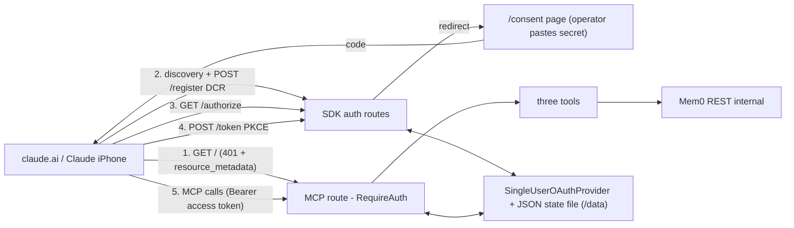

# Design Doc — Minimal self-hosted OAuth for the remote MCP endpoint

## 0. Metadata

- **Scope:** capability — OAuth 2.1 AS+RS on `https://mcp.chandrav.dev/` (replaces the BearerGate transport check)
- **Status:** `built`
- **Author / date:** Build Agent, 2026-06-10
- **Related ADRs:** ADR 035 (decision), ADR 034 (endpoint), ADR 028 (identity contract — untouched)
- **Related interfaces:** `docs/interfaces.md` §13 (remote MCP HTTP surface — auth contract changes)

## 1. Problem & scope

claude.ai custom connectors authenticate only via OAuth (DCR/CIMD) or not at
all; our bearer-token gate cannot be registered there. Goal 2 (Claude iPhone →
live memory bank) is blocked at the registration step.

- **In scope:** OAuth 2.1 authorization-code + PKCE S256 + DCR + refresh, all
  served by the existing `mcp-proxy` container via the `mcp` SDK auth
  framework; a single-user consent page; file-persisted hashed token state;
  static-token fallback on the MCP route.
- **Out of scope / parked:** CIMD, scopes, multi-user, rate limiting (BACKLOG,
  Caddy), token introspection/revocation endpoints, external IdP.
- **Success criteria:** discovery endpoints serve correct metadata; full
  authorize→consent→token→MCP-call round-trip passes in tests and live;
  claude.ai completes its OAuth flow and the connector works on iPhone.

## 2. High-Level Design

Same container, same origin — three layers in one Starlette app (all mounted by
`FastMCP.streamable_http_app()`):



- **`SingleUserOAuthProvider`** (`src/mcp_proxy/oauth.py`): implements the SDK's
  `OAuthAuthorizationServerProvider` protocol — clients, codes, tokens, consent
  transactions. Single responsibility: policy + storage; protocol mechanics
  (PKCE verify, DCR validation, redirect-uri checks, error envelopes) stay in
  the SDK handlers.
- **`OAuthStateStore`** (same module): JSON file load/save, hashing, expiry
  pruning, client cap.
- **`http_server.build_app`**: constructs a dedicated FastMCP instance with
  `AuthSettings` + provider, registers the same three tool functions from
  `mcp_proxy.server`, adds `/health` + `/consent` custom routes.

## 3. Data contracts & schemas

- **OAuth endpoints (SDK-shaped, spec-defined):** `/.well-known/oauth-authorization-server`,
  `/.well-known/oauth-protected-resource`, `/register`, `/authorize`, `/token`.
- **Consent:** `GET /consent?txn=<id>` → HTML form; `POST /consent`
  (`txn`, `secret` form fields) → 302 to client `redirect_uri` with
  `code` + `state` on success; 401 page on wrong secret; 400 on unknown/expired txn.
- **State file** (`/data/oauth_state.json`, file mode 0600):

```json
{
  "clients": {"<client_id>": {"...": "OAuthClientInformationFull dump"}},
  "auth_codes": {"<sha256(code)>": {"client_id": "...", "code_challenge": "...", "redirect_uri": "...", "expires_at": 0.0, "scopes": [], "resource": null, "redirect_uri_provided_explicitly": true}},
  "access_tokens": {"<sha256(token)>": {"client_id": "...", "scopes": [], "expires_at": 0, "resource": null}},
  "refresh_tokens": {"<sha256(token)>": {"client_id": "...", "scopes": [], "expires_at": 0}}
}
```

- **Env contract:** `MCP_CONNECTOR_BEARER_TOKEN` (consent secret + fallback
  access token), `MCP_PUBLIC_BASE_URL` (issuer, default
  `https://mcp.chandrav.dev`), `MCP_OAUTH_STATE_PATH` (default
  `/data/oauth_state.json`), plus existing `MCP_ALLOWED_HOSTS`,
  `AI_MEMORY_BASE_URL`, `AI_MEMORY_API_KEY`.
- **Memory contract (ADR 028):** untouched — transport/auth only.

## 4. Low-Level Design

- `src/mcp_proxy/oauth.py`
  - `OAuthStateStore(path)` — `load()/save()` whole-dict JSON; `_hash(token) = sha256 hex`;
    `prune()` drops expired entries on every save; client insert evicts oldest
    beyond `MAX_CLIENTS = 50`.
  - `SingleUserOAuthProvider(store, consent_secret, issuer)`:
    - `get_client/register_client` — store-backed.
    - `authorize(client, params)` — create txn id (`secrets.token_urlsafe`),
      keep `AuthorizationParams` in an in-memory `dict` (5-min TTL; consent is
      an interactive flow, restart mid-consent just restarts the flow), return
      `{issuer}/consent?txn=...`.
    - `complete_consent(txn, secret)` — `hmac.compare_digest` against
      `consent_secret`; on match mint code (256-bit), persist hashed
      `AuthorizationCode` fields, return redirect URL via SDK
      `construct_redirect_uri` (code + state).
    - `load_authorization_code` — look up by hash, reconstruct
      `AuthorizationCode` (plaintext code field = caller-provided string).
    - `exchange_authorization_code` — single-use (delete code), mint access
      (1 h) + refresh (60 d), persist hashed, return `OAuthToken`.
    - `load_refresh_token/exchange_refresh_token` — hash lookup; rotation:
      delete old refresh + mint new pair.
    - `load_access_token` — static-secret check first
      (`compare_digest(token, consent_secret)` → synthetic always-valid
      `AccessToken`), else hash lookup with expiry check.
    - `revoke_token` — delete matching hashes.
- `src/mcp_proxy/http_server.py`
  - `build_app(...)` builds `FastMCP("ai-memory", auth_server_provider=provider, auth=AuthSettings(issuer_url=..., resource_server_url=..., client_registration_options=ClientRegistrationOptions(enabled=True)))`,
    re-registers `server.search_memories/add_memory/list_memories` via
    `add_tool`, sets stateless + transport security as before, adds
    `/health` + `/consent` custom routes.
  - `main()` unchanged env validation; still requires the secret.

## 5. Failure modes & degradation

- **State file missing/corrupt:** treat as empty — Claude re-runs OAuth
  (re-consent), nothing else breaks; Mem0 data unaffected.
- **Volume not mounted:** tokens become container-lifetime only (same as
  in-memory); endpoint still works.
- **Mem0 down:** OAuth still answers; tool calls return the API error — same
  as today (tenet 4: other surfaces unaffected).
- **Blast radius of a leaked access token:** 1 h of the three MCP tools as
  `chandrav`; refresh leak: 60 d, revocable by deleting the state file entry or
  rotating the consent secret.

## 6. Security & privacy

PKCE S256 enforced by SDK token handler; auth codes single-use, 5-min expiry
(SDK default flow + our deletion-on-exchange); tokens hashed at rest; consent
secret compared constant-time and never persisted/logged; state file 0600 on a
named volume; DCR open per RFC but mints nothing without consent; client store
capped. Secrets stay in env/Bitwarden per ADR 017 — no new secret created.

## 7. Reversibility

Fully reversible (git revert + delete volume). No data-destroying effect; the
auth *model* change was operator-decided (this session's instruction).

## 8. Test plan (TDD)

`tests/test_mcp_proxy/test_oauth.py` + reworked `test_http_server.py`:

1. AS metadata advertises S256, registration endpoint, issuer.
2. Protected-resource metadata points at the issuer.
3. DCR registration returns 201 + client_id; client persisted.
4. `/authorize` (valid client, S256 challenge) → 302 to `/consent?txn=...`.
5. Consent GET renders form; POST wrong secret → 401, no redirect.
6. Consent POST correct secret → 302 to redirect_uri with code + state.
7. Token exchange: correct PKCE verifier → access + refresh; wrong verifier →
   `invalid_grant`; code reuse → `invalid_grant`.
8. Access token authorizes an MCP `initialize` (200).
9. Static `MCP_CONNECTOR_BEARER_TOKEN` still authorizes the MCP route.
10. No/garbage token → 401 with `WWW-Authenticate` containing `resource_metadata`.
11. Refresh grant rotates: old refresh dies, new pair works.
12. Expired access token rejected (clock injection).
13. State survives provider reload (new store on same file).
14. `/health` open; `main()` exits without secret.

Coverage ≥ 80% on `src/` (existing gate).

## 9. Observability

uvicorn access logs (per-route status codes) on the container; failed consent
attempts appear as 401 on `/consent`. Formal metrics stay Phase 8.

## 10. Open questions

None blocking. CIMD support and Caddy rate-limiting for `/consent` parked in
BACKLOG.

## 11. Definition of Done (this module)

- [x] Tests written first, green, ≥80% coverage on new `src/`.
- [x] Contracts reflected in `docs/interfaces.md` §13.
- [x] ADR 035 accepted; this doc marked `built`.
- [x] Docs updated per trigger table (setup.md walkthrough, architecture.md).
- [x] `STATUS.md` checkpointed; repos committed + pushed.
